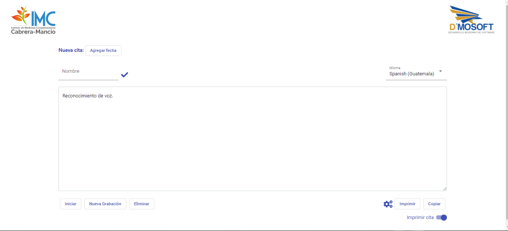

# Speech To Text

Reconocimiento de voz usando webkitSpeechRecognition y Angular.
Debido a que se usó webkit API de google no todos los navegadores son compatibles.

## Desplegar en un entorno de desarrollo

Necesita tener instalado el entorno de angular, clone el repositorio y corra `npm install` para descargar las dependencias, luego corra `ng serve` para ejecutar el servidor de angular para desarrollo. Navegue a `http://localhost:4200/`.

## Vista Previa

## Notas
Las palbaras `coma` y `punto y coma` son remplazadas por `,` y `;` respectivamente, la plabra `enter` inserta un salto de linea.
