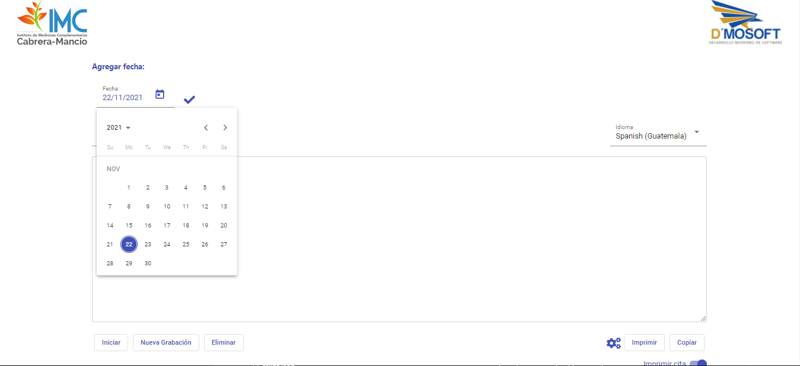
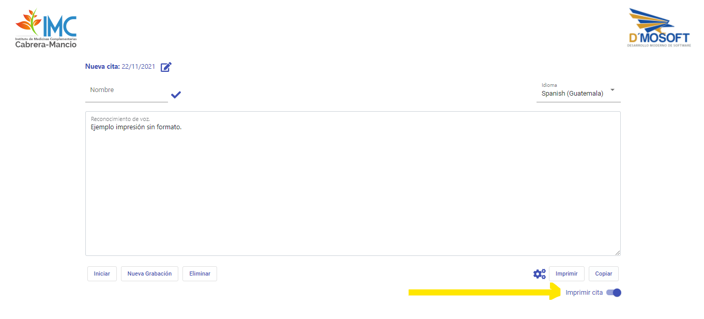
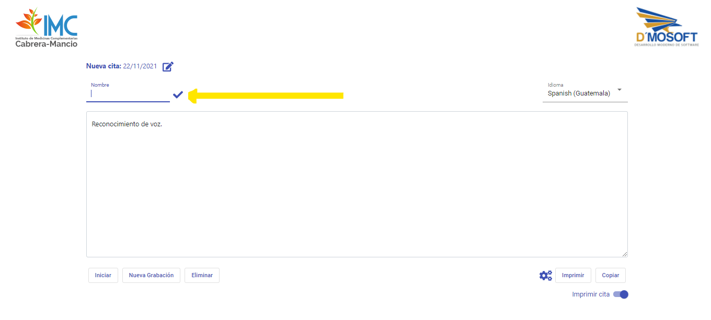
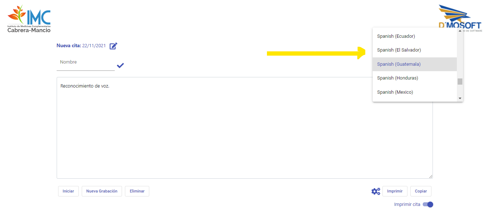
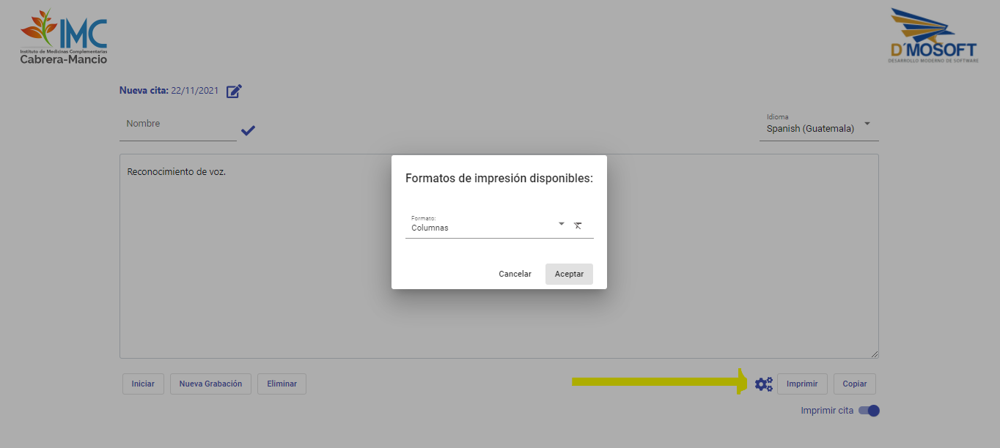
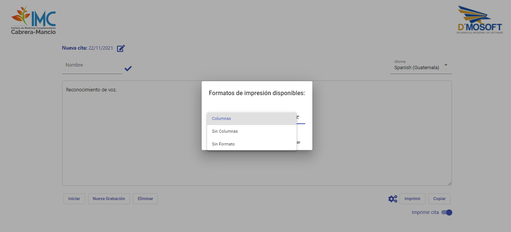
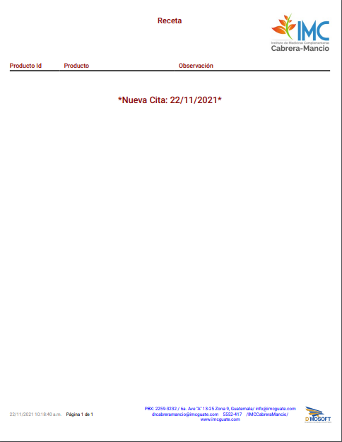
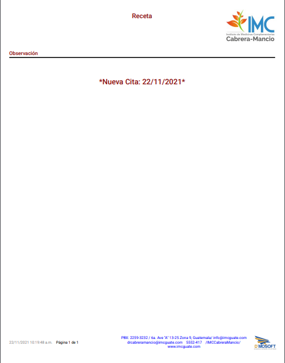
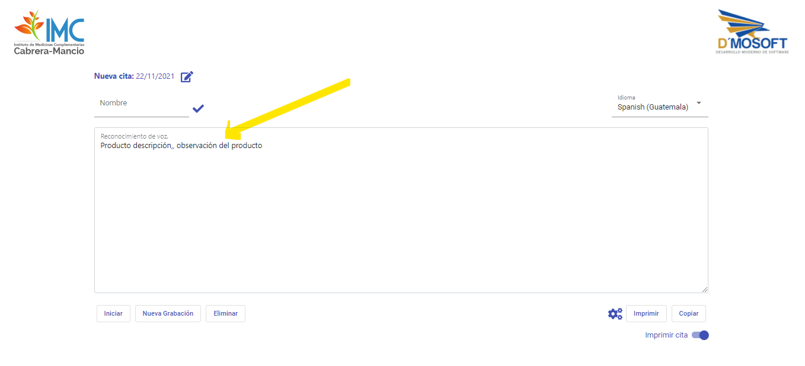
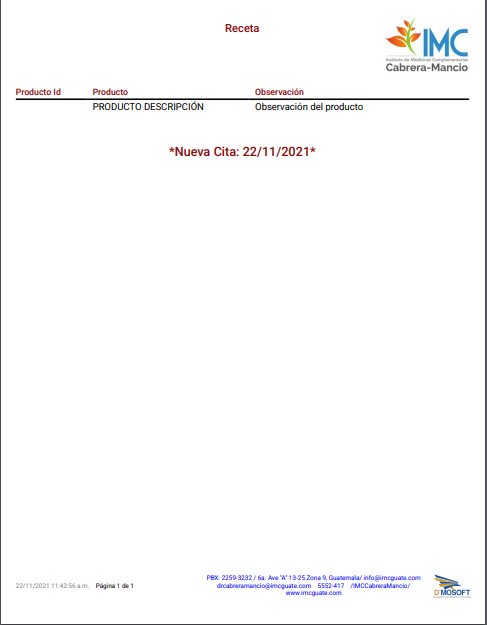

# Speech To Text

Reconocimiento de voz usando webkitSpeechRecognition y Angular.

## Descripción
Transcripción voz a texto en varios idiomas, texto editable para ser copiado en el portapapeles y trabajado en otro lugar, adicionalmnte se puede imprimir el texto transcrito en formatos ya establecidos, el proyecto está hecho con el fin de hacer recetas medicas, pero se puede modificar para agregar o quitar funciones y formatos de impresión.

## Vista Previa

## Caracteristicas

* **Agregar cita:** esta fecha se agrega al final del contendido del documento, indica la nueva cita para el cliente.

   Esta fecha puede ser omitida en la impresión con el botón `Imprimir cita`.

* **Agregar nombre:** este nombre se verá en la impresión, para identidicar quien la está realizando.

* **Selccionar lenguaje de entrada:** este será el lenguaje que podrá ser habalado y transcrito, por defecto es `es-GT` (Español de Guatemala).

* **Seleccionar formato de impresión**

* **Formatos de impresión**

**Columnas:** por defecto se imprime en este formato.

**Sin columnas:** este fomato no imprime la división de columnas.

**Sin formato:** este formato imprime unicamente el texto agregado.

## Caracteristicas adicionales.

* Las palabras `coma` y `punto y coma` son remplazadas por `,` y `;` respectivamente
* La plabra `enter` inserta un salto de linea.
* El botón `Iniciar` inicia el reconocimiento de voz, cuando el reconocimineto está activo este botón cambia a pausar que como lo indica el texto detine el reconocimiento.
* El botón `Eliminar` elimina el texto reconocido.
* El botón `Nueva grabación` elimina el texto reconocido e inicia una nueva grabación.
* El botón `Copiar` copia el texto reconocido a portapapeles.

## Cómo usar.

1. Inicie una grabación con el boton iniciar.
2. Indique con la voz el texto que quiera transcribir.
3. Detenga la grabacion.
4. Una vez tenga el texto, puede copiarlo, editarlo, o imprimirlo.
5. Si desea imprimir el formato *Columnas* el texto debe tener un formato específico, para dividir una columna agregue dos comas al final del texto y para iniciar una nueva fila agregue un salto de linea diciendo *Enter* o pulsando la tecla manualmente. Este es un jemplo de un texto válido `Poducto descripción,, observación del producto`, (la columna Id producto no se usa).

  - Ejemplo formato de texto requerido en el texto para imprimir en formato *Columnas*
  
    
    
  - Resultado formato columnas
    
    

## Ejecutar el proyecto en un entorno de desarrollo

Para ejecutar el proyecto necesita el entorno de Angular CLI.
* [Node.js](https://nodejs.org/es/download/)
* [Angular CLI](https://angular.io/guide/setup-local#install-the-angular-cli)

Si ya está ejecutando Angular CLI clone el proyecto y ejecute `npm install` para descargar las dependencias. Luego ejecute `ng serve` para ejecutar el servidor de Angular. Por defecto angular escucha en el puerto `4200` o `http://localhost:4200/` que es lo mismo, puede especificar el puerto con la bandera `--port` tal que `ng serve --port 4144`, por ejemplo.

## Producción
* Cambie la dirección de origen de las apis en `src/assets/configuraciones.js` si es necesario.
* Ejecute `ng build --prod` para construir el proyecto. 

Los archivos para producción se almacenan en la carpeta `dist/`. Use estos archivos para desplegar la aplicacion en un servidor.

<!--
## Demo

Puede ver una [demostración del proyecto aquí.](https://b3rert.github.io/speech-angular-js/)
-->
## Notas
* Debido a que se usó webkit API de google no todos los navegadores son compatibles.
* Este proyecto tiene funciones personalizadas especificas de la ampresa.
