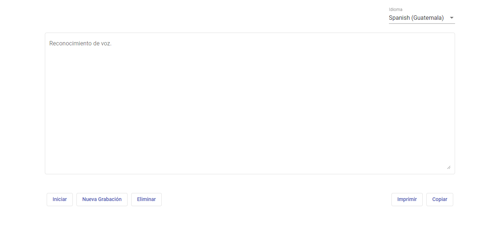

# Speech To Text

Reconocimiento de voz usando webkitSpeechRecognition y Angular.

## Descripción
Transcripción voz a texto en varios idiomas, es posible editar el texto y/o imprimirlo.

## Vista Previa 

## Caracteristicas

* Soporte para varios lenguajes de entrada, por defecto es español de Guatemala (es-GT).
* Las palabras `coma` y `punto y coma` son remplazadas por `,` y `;` respectivamente.
* La palabra `enter` inserta un salto de linea.
* El botón `Iniciar` inicia el reconocimiento de voz, cuando el reconocimineto está activo este botón cambia a pausar que como lo indica el texto detine el reconocimiento.
* El botón `Eliminar` elimina el texto reconocido.
* El botón `Nueva grabación` elimina el texto reconocido e inicia una nueva grabación.
* El botón `Copiar` copia el texto reconocido a portapapeles.
* El botón `Imprimir` genera un documento pdf para posteriormente ser impreso.

## Cómo usar.
0. Seleccione un idioma de entrada si lo desea.
1. Inicie una grabación con el boton iniciar.
2. Indique con la voz el texto que quiera transcribir.
3. Detenga la grabacion.
4. Una vez tenga el texto, puede copiarlo, editarlo, o imprimirlo.

## Ejecutar el proyecto en un entorno de desarrollo

Para ejecutar el proyecto necesita el entorno de Angular CLI.
* [Node.js](https://nodejs.org/es/download/)
* [Angular CLI](https://angular.io/guide/setup-local#install-the-angular-cli)

Si ya está ejecutando Angular CLI clone el proyecto y ejecute `npm install` para descargar las dependencias. Luego ejecute `ng serve` para ejecutar el servidor de Angular. Por defecto angular escucha en el puerto `4200` o `http://localhost:4200/` que es lo mismo, puede especificar el puerto con la bandera `--port` tal que `ng serve --port 4144`, por ejemplo.

## Producción
* Cambie la dirección de origen de las apis en `src/assets/configuraciones.js` si es necesario.
* Ejecute `ng build --prod` para construir el proyecto. 

Los archivos para producción se almacenan en la carpeta `dist/`. Use estos archivos para desplegar la aplicacion en un servidor.

## Demo

Puede ver una [demostración del proyecto aquí.](https://b3rert.github.io/SpeechToText/)

## Notas
* Debido a que se usó webkit API de google no todos los navegadores son compatibles.
